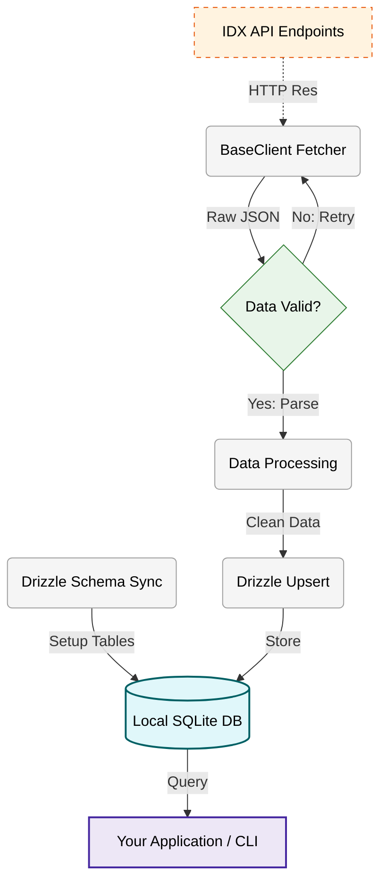

# Indonesian Stock Exchange API Wrapper [](https://opensource.org/licenses/MIT)

A data pipeline for the Indonesian Stock Exchange (IDX). Built with Deno and Drizzle ORM to sync official market data into a structured SQLite database. It includes automated retries for network stability and provides modules for company info, indices, and trading data. Focused on reliable data collection.

## Installation

```bash
# Clone the repository
git clone https://github.com/NeaByteLab/IDX-API.git

# Enter the project directory
cd IDX-API/

# Initialize the database (Drizzle generate & push)
deno task db:sync
```

## Requirements

- **[Deno](https://deno.com/)** (v2.5.0 or higher recommended)
- **Git** (for cloning the repository)

## Technology Stack

- **Runtime**: [Deno](https://deno.com/) (Modern, Secure, High-Performance)
- **Database**: [SQLite](https://www.sqlite.org/) via [LibSQL Client](https://github.com/tursodatabase/libsql-client-ts)
- **ORM**: [Drizzle ORM](https://orm.drizzle.team/) (Type-Safe SQL ORM)

## Pipeline Overview



## General Examples

### **Corporate Modules**

```typescript
import * as sync from '@app/Backend/Sync/index.ts'

// Update newly added shares listings (year, month)
await sync.syncAdditionalListing(2024, 2)

// Archive official corporate news/announcements (YYYYMMDD)
await sync.syncCompanyAnnouncement('20240220')

// Track companies removed from the exchange (year, month)
await sync.syncCompanyDelisting(2024, 2)

// Monitor upcoming dividend payments (year, month)
await sync.syncCompanyDividend(2024, 2)

// 1:1 sync of all listed company metadata (No parameters needed)
await sync.syncCompanyProfile()

// Update companies returning to the exchange (No parameters needed)
await sync.syncCompanyRelisting()

// Sync current list of suspended securities (No parameters needed)
await sync.syncCompanySuspend()

// Update fundamental indicators: PER, PBV, ROE, DER (year, month)
await sync.syncFinancialRatio(2024, 2)

// Track Initial Public Offerings / IPOs (year, month)
await sync.syncNewListing(2024, 2)

// Archive subscription right offering details (year, month)
await sync.syncRightOffering(2024, 2)

// Record stock split ratios and nominal changes (year, month)
await sync.syncStockSplit(2024, 2)
```

### **General Modules**

```typescript
import * as sync from '@app/Backend/Sync/index.ts'

// Sync exchange holiday and event calendar (YYYYMMDD)
await sync.syncMarketCalendar('20240220')

// Update the master list of all security tickers (No parameters needed)
await sync.syncSecurityStock()
```

### **Market Modules**

```typescript
import * as sync from '@app/Backend/Sync/index.ts'

// Sync daily closing values for market indices (year, month)
await sync.syncDailyIndex(2024, 2)

// Record foreign investor inflow/outflow metrics (year, month)
await sync.syncForeignTrading(2024, 2)

// Sync 1-year historical chart data for a specific index (index code)
await sync.syncIndexChart('COMPOSITE')

// Update real-time prices & change percentages for all indices (No parameters needed)
await sync.syncIndexList()

// Record daily summary snapshots for every market index (YYYYMMDD)
await sync.syncIndexSummary('20240220')

// Compare performance changes across bursa sectors (year, month)
await sync.syncSectoralMovement(2024, 2)

// Sync monthly rankings of top gainers by percentage (year, month)
await sync.syncTopGainer(2024, 2)

// Sync monthly rankings of top losers by percentage (year, month)
await sync.syncTopLoser(2024, 2)
```

### **Participants Modules**

```typescript
import * as sync from '@app/Backend/Sync/index.ts'

// Update registered repository of exchange broker profiles (No parameters needed)
await sync.syncBrokerParticipant()

// Update the list of authorized Primary Dealers (No parameters needed)
await sync.syncDealerParticipant()

// Sync detailed participant profile information (No parameters needed)
await sync.syncProfileParticipant()
```

### **Statistics Modules**

```typescript
import * as sync from '@app/Backend/Sync/index.ts'

// Record stocks with the most active transaction counts (year, month)
await sync.syncActiveFrequency(2024, 2)

// Record stocks with the highest trading value (year, month)
await sync.syncActiveValue(2024, 2)

// Record stocks with the highest trading volume (year, month)
await sync.syncActiveVolume(2024, 2)
```

### **Trading Modules**

```typescript
import * as sync from '@app/Backend/Sync/index.ts'

// Sync detailed broker trading activity per stock (YYYYMMDD)
await sync.syncBrokerSummary('20240220')

// Sync daily activity metrics for domestic investors (year, month)
await sync.syncDomesticTrading(2024, 2)

// Aggregate trading trends classified by industry (year, month)
await sync.syncIndustryTrading(2024, 2)

// Sync OHLC, Volume, and Foreign Flow for every stock ticker (YYYYMMDD)
await sync.syncStockSummary('20240220')

// Sync general daily aggregate of all market segments (No parameters needed)
await sync.syncTradeSummary()
```

### **Direct API Access**

```typescript
import IDXClient from '@app/index.ts'

// Create service instance
const client = new IDXClient()

// Fetch company announcements with optional filters
const announcements = await client.company.getAnnouncements(
  'BBCA', // companyCode: Filter by ticker
  9999, // pageSize: Limit per request
  0, // indexFrom: Pagination cursor
  '20240101', // dateFrom: Start date YYYYMMDD
  '20241231' // dateTo: End date YYYYMMDD
)

// Get current price snapshot for all bursa indices
const indices = await client.market.getIndexList()

// Fetch stock summary (OHLC, Volume, Foreign Flow) for a specific date
const stockSummary = await client.trading.getStockSummary('20240220')

// Search registered exchange brokers with pagination
const brokers = await client.participants.getBrokerSearch(0, 100) // start, length
```

## **Modules Feature List**

All synchronization tasks are designed to move raw API data into your local structured database.

| Feature Name              | Category     | Description (Functionality)                                                               |
| :------------------------ | :----------- | :---------------------------------------------------------------------------------------- |
| `syncAdditionalListing`   | Corporate    | Synchronizes records of newly added shares listings for listed companies.                 |
| `syncCompanyAnnouncement` | Corporate    | Fetches and archives official corporate news and announcements from listed companies.     |
| `syncCompanyDelisting`    | Corporate    | Tracks companies that have been officially removed from the exchange listing.             |
| `syncCompanyDividend`     | Corporate    | Monitors historical and upcoming dividend payment dates and amounts.                      |
| `syncCompanyProfile`      | Corporate    | Syncs detailed metadata, directors, and ownership for all listed companies.               |
| `syncCompanyRelisting`    | Corporate    | Monitors companies returning to the exchange after a suspension/delisting period.         |
| `syncCompanySuspend`      | Corporate    | Provides a real-time list of securities currently under trading suspension.               |
| `syncFinancialRatio`      | Corporate    | Updates key financial indicators (PER, PBV, ROE, DER) for fundamental analysis.           |
| `syncNewListing`          | Corporate    | Tracks Initial Public Offerings (IPO) and newly listed stock details.                     |
| `syncRightOffering`       | Corporate    | Synchronizes detailed metadata for subscription right offerings.                          |
| `syncStockSplit`          | Corporate    | Captures historical and planned corporate stock split ratios and nominal changes.         |
| `syncMarketCalendar`      | General      | Synchronizes trading holidays, public events, and corporate schedules.                    |
| `syncSecurityStock`       | General      | Updates the master list of all listed security stocks and their board types.              |
| `syncDailyIndex`          | Market       | Synchronizes time-series data for daily market index performance.                         |
| `syncForeignTrading`      | Market       | Tracks capital inflow and outflow from foreign investors in real-time.                    |
| `syncIndexChart`          | Market       | Stores secondary-resolution historical price points for market index charting.            |
| `syncIndexList`           | Market       | Keeps an updated list of current prices and changes for all bursa indices.                |
| `syncIndexSummary`        | Market       | Records daily performance snapshots including points, change, and volume for all indices. |
| `syncSectoralMovement`    | Market       | Monitors performance comparison and changes across different market sectors.              |
| `syncTopGainer`           | Market       | Tracks the daily list of stocks with the highest price percentage increase.               |
| `syncTopLoser`            | Market       | Tracks the daily list of stocks with the highest price percentage decrease.               |
| `syncBrokerParticipant`   | Participants | Keeps a repository of registered Exchange Member (Brokers).                               |
| `syncDealerParticipant`   | Participants | Updates the list of authorized Primary Dealers in the exchange.                           |
| `syncProfileParticipant`  | Participants | Syncs detailed information and profiles of exchange participants.                         |
| `syncActiveFrequency`     | Statistics   | Identifies and updates the daily leaders in terms of transaction frequency.               |
| `syncActiveValue`         | Statistics   | Tracks stocks with the highest daily transaction value.                                   |
| `syncActiveVolume`        | Statistics   | Tracks stocks with the highest daily transaction volume.                                  |
| `syncBrokerSummary`       | Trading      | Captures detailed daily trading activity and summaries for every authorized broker.       |
| `syncDomesticTrading`     | Trading      | Summarizes trading activity and volumes driven by domestic investors.                     |
| `syncIndustryTrading`     | Trading      | Aggregates and tracks trading activity trends across different industries.                |
| `syncStockSummary`        | Trading      | Syncs detailed daily trading stats (OHLC, Volume, Foreign Flow) for every stock.          |
| `syncTradeSummary`        | Trading      | Synchronizes a general daily summary of total market trade activity.                      |

## API Reference

### company.getAdditionalListings

```typescript
client.company.getAdditionalListings(year, month, pageSize, pageNumber)
```

- `year` `<number>`: Target year
- `month` `<number>`: Target month (1-12)
- `pageSize` `<number>`: (Optional) Record count limit. Defaults to 10.
- `pageNumber` `<number>`: (Optional) Pagination page number. Defaults to 1.
- Returns: `Promise<Types.CompanyPaginatedResponse<Types.AdditionalListing> | null>`
- Description: Returns paginated list of newly added shares listings.

### company.getAnnouncements

```typescript
client.company.getAnnouncements(companyCode, pageSize, indexFrom, dateFrom, dateTo, language)
```

- `companyCode` `<string>`: (Optional) Company ticker filter. Defaults to `''`.
- `pageSize` `<number>`: (Optional) Record count limit. Defaults to 9999.
- `indexFrom` `<number>`: (Optional) Pagination start index. Defaults to 0.
- `dateFrom` `<string>`: (Optional) Start date YYYYMMDD. Defaults to `''`.
- `dateTo` `<string>`: (Optional) End date YYYYMMDD. Defaults to `''`.
- `language` `<string>`: (Optional) Language code (id/en). Defaults to `'id'`.
- Returns: `Promise<Types.AnnouncementResponse | null>`
- Description: Returns filtered IDX announcements data.

### company.getCompanyProfiles

```typescript
client.company.getCompanyProfiles(start, length)
```

- `start` `<number>`: (Optional) Starting record index. Defaults to 0.
- `length` `<number>`: (Optional) Maximum record count. Defaults to 9999.
- Returns: `Promise<Types.CompanyProfileResponse | null>`
- Description: Returns list of basic company profile information.

### company.getCompanyProfilesDetail

```typescript
client.company.getCompanyProfilesDetail(companyCode, language)
```

- `companyCode` `<string>`: Company ticker code (e.g., BBCA).
- `language` `<string>`: (Optional) Language code (id-id). Defaults to `'id-id'`.
- Returns: `Promise<Types.CompanyDetailResponse | null>`
- Description: Returns exhaustive metadata for a specific company ticker.

### company.getDelistings

```typescript
client.company.getDelistings(year, month, pageSize, pageNumber)
```

- `year` `<number>`: Target year
- `month` `<number>`: Target month (1-12)
- `pageSize` `<number>`: (Optional) Record count limit. Defaults to 10.
- `pageNumber` `<number>`: (Optional) Pagination page number. Defaults to 1.
- Returns: `Promise<Types.CompanyPaginatedResponse<Types.Delisting> | null>`
- Description: Returns paginated list of delisted stocks.

### company.getDividendAnnouncements

```typescript
client.company.getDividendAnnouncements(year, month, pageSize, pageNumber)
```

- `year` `<number>`: Target year
- `month` `<number>`: Target month (1-12)
- `pageSize` `<number>`: (Optional) Record count limit. Defaults to 10.
- `pageNumber` `<number>`: (Optional) Pagination page number. Defaults to 1.
- Returns: `Promise<Types.CompanyPaginatedResponse<Types.DividendAnnouncement> | null>`
- Description: Returns paginated list of dividend events.

### company.getFinancialRatios

```typescript
client.company.getFinancialRatios(year, month)
```

- `year` `<number>`: Target year
- `month` `<number>`: Target month (1-12)
- Returns: `Promise<Types.CompanyPaginatedResponse<Types.FinancialRatio> | null>`
- Description: Returns paginated financial indicators.

### company.getNewListings

```typescript
client.company.getNewListings(year, month, pageSize, pageNumber)
```

- `year` `<number>`: Target year
- `month` `<number>`: Target month (1-12)
- `pageSize` `<number>`: (Optional) Record count limit. Defaults to 10.
- `pageNumber` `<number>`: (Optional) Pagination page number. Defaults to 1.
- Returns: `Promise<Types.CompanyPaginatedResponse<Types.NewListing> | null>`
- Description: Returns paginated list of newly listed stocks.

### company.getRelistingData

```typescript
client.company.getRelistingData(pageSize, indexFrom)
```

- `pageSize` `<number>`: (Optional) Record count per page. Defaults to 9999.
- `indexFrom` `<number>`: (Optional) Pagination start index. Defaults to 0.
- Returns: `Promise<Types.RelistingResponse | null>`
- Description: Returns companies that have been relisted.

### company.getRightOfferings

```typescript
client.company.getRightOfferings(year, month, pageSize, pageNumber)
```

- `year` `<number>`: Target year
- `month` `<number>`: Target month (1-12)
- `pageSize` `<number>`: (Optional) Record count limit. Defaults to 10.
- `pageNumber` `<number>`: (Optional) Pagination page number. Defaults to 1.
- Returns: `Promise<Types.CompanyPaginatedResponse<Types.RightOffering> | null>`
- Description: Returns paginated list of subscription right offerings.

### company.getSecuritiesStock

```typescript
client.company.getSecuritiesStock(start, length, code, sector, board)
```

- `start` `<number>`: (Optional) Starting record index. Defaults to 0.
- `length` `<number>`: (Optional) Maximum record count. Defaults to 9999.
- `code` `<string>`: (Optional) Ticker code filter. Defaults to `''`.
- `sector` `<string>`: (Optional) Sector filter. Defaults to `''`.
- `board` `<string>`: (Optional) Board category filter. Defaults to `''`.
- Returns: `Promise<Types.SecuritiesStockResponse | null>`
- Description: Returns list of IDX listed companies.

### company.getStockSplits

```typescript
client.company.getStockSplits(year, month, pageSize, pageNumber)
```

- `year` `<number>`: Target year
- `month` `<number>`: Target month (1-12)
- `pageSize` `<number>`: (Optional) Record count limit. Defaults to 10.
- `pageNumber` `<number>`: (Optional) Pagination page number. Defaults to 1.
- Returns: `Promise<Types.CompanyPaginatedResponse<Types.StockSplit> | null>`
- Description: Returns paginated list of stock split events.

### company.getSuspendData

```typescript
client.company.getSuspendData(resultCount)
```

- `resultCount` `<number>`: (Optional) Number of recent events. Defaults to 9999.
- Returns: `Promise<Types.SuspendResponse | null>`
- Description: Returns list of recently suspended securities.

### market.getCalendar

```typescript
client.market.getCalendar(date)
```

- `date` `<string>`: Date in YYYYMMDD format
- Returns: `Promise<Types.CalendarResponse | null>`
- Description: Returns agenda and events for specified date.

### market.getDailyIndices

```typescript
client.market.getDailyIndices(year, month)
```

- `year` `<number>`: Target year
- `month` `<number>`: Target month (1-12)
- Returns: `Promise<Types.DailyIndexData[] | null>`
- Description: Returns time-series data for a market index.

### market.getIndexChart

```typescript
client.market.getIndexChart(indexCode, period)
```

- `indexCode` `<string>`: Target index code
- `period` `<string>`: (Optional) Time frame (1D, 1W, 1M, 1Q, 1Y). Defaults to `'1D'`.
- Returns: `Promise<Types.IndexChartResponse | null>`
- Description: Returns time-series data for a specific index.

### market.getIndexList

```typescript
client.market.getIndexList()
```

- Returns: `Promise<Types.IndexData[] | null>`
- Description: Returns current prices and changes for all indices.

### market.getSectoralMovement

```typescript
client.market.getSectoralMovement(year, month)
```

- `year` `<number>`: Target year
- `month` `<number>`: Target month (1-12)
- Returns: `Promise<Types.SectoralMovementResponse | null>`
- Description: Returns performance comparison between indices over time.

### participants.getBrokerSearch

```typescript
client.participants.getBrokerSearch(start, length)
```

- `start` `<number>`: (Optional) Pagination start index. Defaults to 0.
- `length` `<number>`: (Optional) Maximum record count. Defaults to 9999.
- Returns: `Promise<Types.BrokerProfile[] | null>`
- Description: Returns list of registered exchange brokers.

### participants.getParticipantSearch

```typescript
client.participants.getParticipantSearch(start, length, codeOrName, license)
```

- `start` `<number>`: (Optional) Pagination start index. Defaults to 0.
- `length` `<number>`: (Optional) Maximum record count. Defaults to 9999.
- `codeOrName` `<string>`: (Optional) Filter by code or name. Defaults to `''`.
- `license` `<string>`: (Optional) Filter by license type. Defaults to `''`.
- Returns: `Promise<Types.PaginatedResponse<Types.ParticipantProfile> | null>`
- Description: Returns paginated list of market participants.

### participants.getPrimaryDealerSearch

```typescript
client.participants.getPrimaryDealerSearch(start, length, codeOrName, license)
```

- `start` `<number>`: (Optional) Pagination start index. Defaults to 0.
- `length` `<number>`: (Optional) Maximum record count. Defaults to 9999.
- `codeOrName` `<string>`: (Optional) Filter by code or name. Defaults to `''`.
- `license` `<string>`: (Optional) Filter by license type. Defaults to `''`.
- Returns: `Promise<Types.PaginatedResponse<Types.PrimaryDealerProfile> | null>`
- Description: Returns paginated list of primary dealers.

### statistics.discover

```typescript
client.statistics.discover(featureList)
```

- `featureList` `<Types.DigitalFeatures[]>`: Features to process for discovery
- Returns: `Promise<string>`
- Description: Maps features into a markdown summary table.

### statistics.saveOutput

```typescript
client.statistics.saveOutput(content, fileName)
```

- `content` `<string>`: Markdown content to save
- `fileName` `<string>`: (Optional) Target destination file path. Defaults to `'Draft_Statistic_API.md'`.
- Returns: `Promise<void>`
- Description: Writes generated markdown to a physical file.

### trading.getBrokerSummary

```typescript
client.trading.getBrokerSummary(date, start, length)
```

- `date` `<string>`: Date in YYYYMMDD format
- `start` `<number>`: (Optional) Start record index. Defaults to 0.
- `length` `<number>`: (Optional) Maximum record count. Defaults to 9999.
- Returns: `Promise<Types.TradingResponse<Types.BrokerSummary> | null>`
- Description: Returns paginated broker activity and trading summary.

### trading.getDomesticTradingSummary

```typescript
client.trading.getDomesticTradingSummary(year, month)
```

- `year` `<number>`: Target year
- `month` `<number>`: Target month (1-12)
- Returns: `Promise<Types.InvestorTradingSummary[] | null>`
- Description: Returns domestic investor daily trading activity metrics.

### trading.getForeignTradingSummary

```typescript
client.trading.getForeignTradingSummary(year, month)
```

- `year` `<number>`: Target year
- `month` `<number>`: Target month (1-12)
- Returns: `Promise<Types.InvestorTradingSummary[] | null>`
- Description: Returns foreign investor daily trading activity metrics.

### trading.getIndexSummary

```typescript
client.trading.getIndexSummary(date, start, length)
```

- `date` `<string>`: Date in YYYYMMDD format
- `start` `<number>`: (Optional) Start record index. Defaults to 0.
- `length` `<number>`: (Optional) Maximum record count. Defaults to 9999.
- Returns: `Promise<Types.TradingResponse<Types.IndexSummary> | null>`
- Description: Returns performance data for market indices.

### trading.getIndustryTradingSummary

```typescript
client.trading.getIndustryTradingSummary(year, month)
```

- `year` `<number>`: Target year
- `month` `<number>`: Target month (1-12)
- Returns: `Promise<Types.IndustryTradingSummary[] | null>`
- Description: Returns aggregate trading data classified by industry subset.

### trading.getMostActiveByFrequency

```typescript
client.trading.getMostActiveByFrequency(year, month)
```

- `year` `<number>`: Target year
- `month` `<number>`: Target month (1-12)
- Returns: `Promise<Types.ActiveStockResponse | null>`
- Description: Returns paginated list of top active stocks by frequency.

### trading.getMostActiveByValue

```typescript
client.trading.getMostActiveByValue(year, month)
```

- `year` `<number>`: Target year
- `month` `<number>`: Target month (1-12)
- Returns: `Promise<Types.ActiveStockResponse | null>`
- Description: Returns paginated list of top active stocks by value.

### trading.getMostActiveByVolume

```typescript
client.trading.getMostActiveByVolume(year, month)
```

- `year` `<number>`: Target year
- `month` `<number>`: Target month (1-12)
- Returns: `Promise<Types.ActiveStockResponse | null>`
- Description: Returns paginated list of top active stocks by volume.

### trading.getStockSummary

```typescript
client.trading.getStockSummary(date)
```

- `date` `<string>`: Date in YYYYMMDD format
- Returns: `Promise<Types.StockSummary[] | null>`
- Description: Detailed stock summaries with OHLC data.

### trading.getTopGainers

```typescript
client.trading.getTopGainers(year, month)
```

- `year` `<number>`: Target year
- `month` `<number>`: Target month (1-12)
- Returns: `Promise<Types.TopStockSummary[] | null>`
- Description: Returns list of top 20 gaining stocks.

### trading.getTopLosers

```typescript
client.trading.getTopLosers(year, month)
```

- `year` `<number>`: Target year
- `month` `<number>`: Target month (1-12)
- Returns: `Promise<Types.TopStockSummary[] | null>`
- Description: Returns list of top 20 losing stocks.

### trading.getTradeSummary

```typescript
client.trading.getTradeSummary()
```

- Returns: `Promise<Types.TradeSummary[] | null>`
- Description: General market segment trading aggregate data.

## License

This project is licensed under the MIT license. See the [LICENSE](LICENSE) file for more info.
